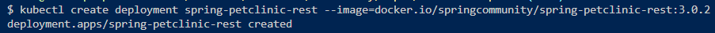
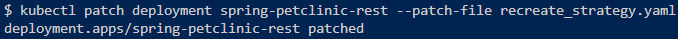
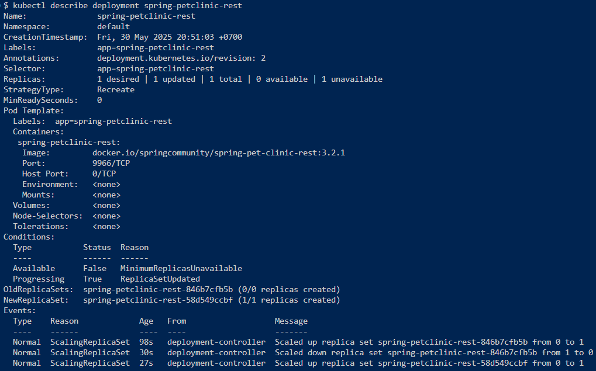
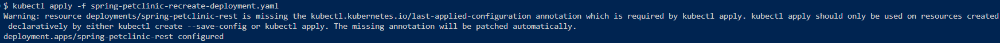
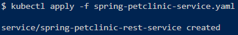
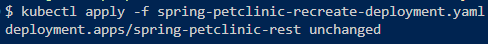
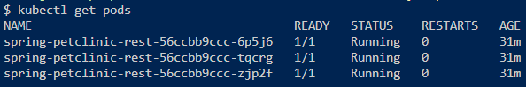
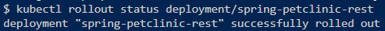
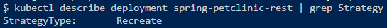

**Nama  : Nisrina Annaisha Sarnadi   
NPM   : 2306275960  
Kelas : B**

Refleksi
---

### Hello Minikube

#### 1. Perbandingan Application Logs Sebelum dan Sesudah Exposed sebagai Service

**Sebelum exposed sebagai Service:**
- Aplikasi berjalan di dalam pod tetapi tidak dapat diakses dari luar cluster
- Logs hanya menunjukkan startup aplikasi dan health checks internal
- Tidak ada traffic masuk karena tidak ada cara untuk mengakses aplikasi

**Sesudah exposed sebagai Service:**
- Ketika `minikube service hello-node` dijalankan, aplikasi menjadi dapat diakses melalui browser
- Setiap kali aplikasi dibuka di browser, akan muncul log request HTTP baru
- Jumlah log akan bertambah setiap kali dilakukan akses terhadap aplikasi karena setiap request HTTP akan tercatat

Untuk melihat logs:
```bash
kubectl logs deployment/hello-node -f
```

#### 2. Perbedaan `kubectl get` dengan dan tanpa opsi `-n`

**Tanpa opsi `-n`:**
```bash
kubectl get pods,services
```
- Menampilkan pods dan services di **namespace default**
- Pods/services yang Anda buat (seperti hello-node) berada di namespace default

**Dengan opsi `-n kube-system`:**
```bash
kubectl get pods,services -n kube-system
```
- Menampilkan pods dan services di **namespace kube-system**
- Namespace kube-system berisi komponen sistem Kubernetes (seperti coredns, etcd, kube-apiserver, dll.)

**Mengapa output tidak menampilkan pods/services yang Anda buat?**

Pods dan Services yang saya buat secara eksplisit (hello-node) tidak ditampilkan karena berada di namespace **default**, sedangkan perintah dengan `-n kube-system` hanya menampilkan resource yang ada di namespace **kube-system**.


### Rolling Update & Kubernetes Manifest File

#### 1. Perbedaan antara Rolling Update dan Recreate Deployment Strategy  

**Rolling Update**    
- Pod lama tetap berjalan sambil pod baru dibuat secara bertahap  
- Tidak ada downtime karena selalu ada pod yang melayani traffic  
- Update dilakukan satu per satu atau beberapa pod sekaligus  
- Rollback mudah dilakukan jika ada masalah  
- Cocok untuk aplikasi production yang membutuhkan high availability  

**Recreate**   
- Semua pod lama dihentikan terlebih dahulu, baru pod baru dibuat  
- Ada downtime selama proses update  
- Lebih cepat dalam hal resource usage  
- Cocok untuk aplikasi yang tidak bisa berjalan dalam versi berbeda secara bersamaan  
- Cocok untuk development/testing environment   

#### 2. Mencoba Deploy Spring Petclinic REST dengan Recreate Strategy  
Untuk mendeploy dengan recreate stragey, saya mulai dengan menghapus deployment yang sudah ada. Kemudian membuat file ```recreate_strategy.yaml``` sebagai modifikasi file ```deployment.yaml```.

Selanjutnya, saya membuat deployment baru dengan strategi Recreate:  
```bash
kubectl create deployment spring-petclinic-rest --image=docker.io/springcommunity/spring-petclinic-rest:3.0.2
kubectl patch deployment spring-petclinic-rest --patch-file recreate_strategy.yaml
```



Mengecek hasil deployment dengan verifikasi strategi deployment:  
```bash
kubectl describe deployment spring-petclinic-rest
```


#### 3. Manifest Files untuk Recreate Deployment Strategy  

**File: `spring-petclinic-recreate-deployment.yaml`**
File ini adalah Kubernetes Deployment yang berfungsi untuk mendefinisikan dan mengelola aplikasi Spring PetClinic REST API di dalam cluster Kubernetes.

```yaml
apiVersion: apps/v1
kind: Deployment
metadata:
  name: spring-petclinic-rest
  labels:
    app: spring-petclinic-rest
spec:
  replicas: 3
  strategy:
    type: Recreate  
  selector:
    matchLabels:
      app: spring-petclinic-rest
  template:
    metadata:
      labels:
        app: spring-petclinic-rest
    spec:
      containers:
      - name: spring-petclinic-rest
        image: docker.io/springcommunity/spring-petclinic-rest:3.0.2
        ports:
        - containerPort: 9966
        resources:
          requests:
            memory: "256Mi"
            cpu: "250m"
          limits:
            memory: "512Mi"
            cpu: "500m"
```

**File: `spring-petclinic-service.yaml`**  
Service diperlukan untuk mengakses aplikasi dari luar cluster.  

```yaml
apiVersion: v1
kind: Service
metadata:
  name: spring-petclinic-rest-service
  labels:
    app: spring-petclinic-rest
spec:
  type: LoadBalancer
  ports:
  - port: 9966
    targetPort: 9966
    protocol: TCP
  selector:
    app: spring-petclinic-rest
```

Deploy dengan Recreate Strategy  
```bash
kubectl apply -f spring-petclinic-recreate-deployment.yaml
kubectl apply -f spring-petclinic-service.yaml
```
  


Update aplikasi ke versi baru  
```bash
kubectl apply -f spring-petclinic-recreate-deployment.yaml
```
   

Monitor proses update   
```bash
kubectl get pods -w
kubectl rollout status deployment/spring-petclinic-rest
```



Cek hasil deployment dengan verifikasi strategi deployment
```bash
kubectl describe deployment spring-petclinic-rest | grep Strategy
```


**Recreate Strategy:**  
- Semua pod akan terminated terlebih dahulu  
- Status akan menunjukkan 0/3 pods ready selama update  
- Downtime terjadi sampai pod baru siap  

**Rolling Update Strategy:**  
- Pod di-update satu per satu  
- Selalu ada pod yang running selama update  
- Tidak ada downtime  

#### 4. Keuntungan Menggunakan Kubernetes Manifest Files    
Setelah membandingkan deployment manual dengan manifest files di Kubernetes, saya menemukan bahwa pendekatan manual rentan error dan sulit dikelola. Sebaliknya, manifest files menawarkan banyak keunggulan: bersifat deklaratif, mudah di-versioning melalui Git, memberikan hasil konsisten, sekaligus berfungsi sebagai dokumentasi, mudah mengatur resource limits serta health checks, dan mudah melakukan rollback.